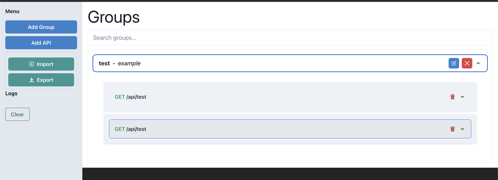
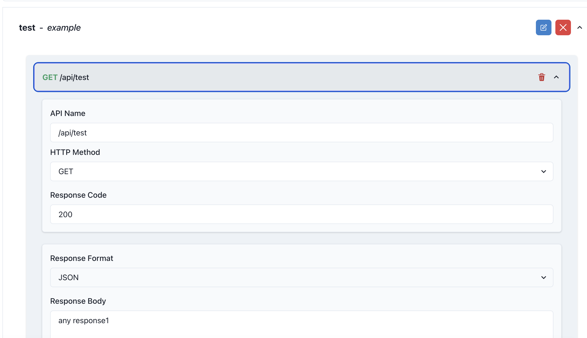
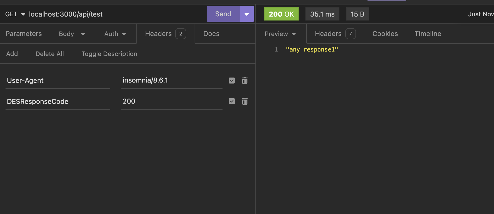
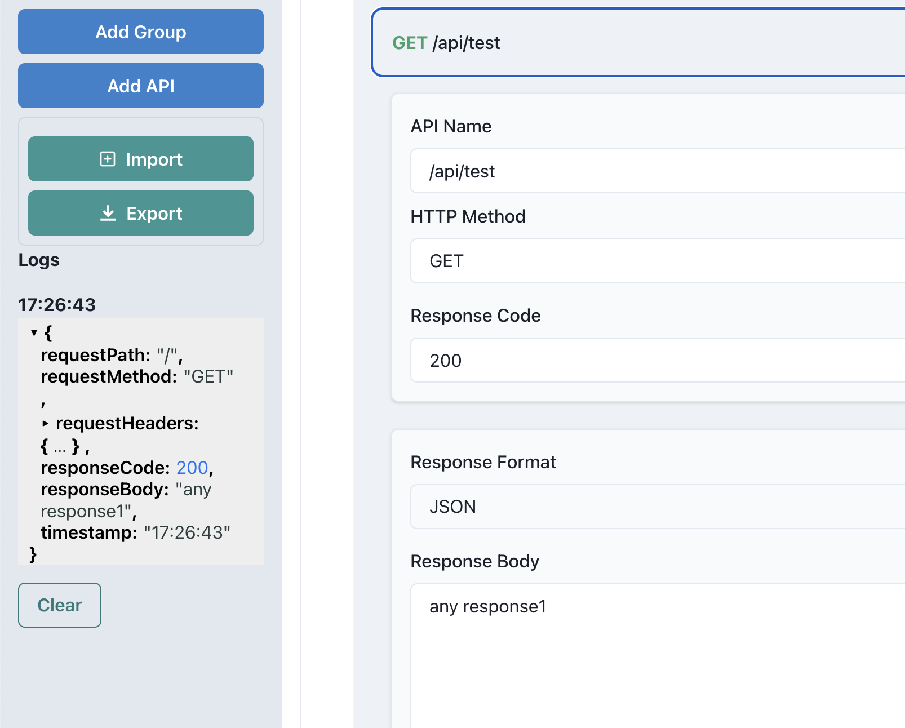

This project is a React-based application that serves as an echo server. The application allows users to input API details such as the API path, API method, API response code, and headers. When these APIs are hit, they return the values that were input by the user.

The application is written in TypeScript and uses the Chakra UI library for its components. It also uses Redux for state management.


The application also includes a backend server written in Node.js with Express. The server code is located in the `backendNode/src/index.ts` file. This server includes several routes for managing API details and for the echo functionality.

Please note that the routes starting with `/api/des/*` are reserved for internal use and should not be called directly. These routes are used for managing the API details.

## Getting Started

To get started with this project, you need to clone the repository and then run the `deploy.sh` script. Here are the steps:

```bash
git clone git@github.com:blance97/DataEchoServer.git
cd DataEchoServer
bash ./deploy.sh
```

This script will check if the `dist` directory exists. If it doesn't, it will navigate into the `EchoServerReact` directory, install the necessary npm packages, and build the project. After that, it will start the Docker containers using `docker-compose up`.

This is a simplified description of the project. For more detailed information, refer to the individual files and their comments.

Photos of the application can be found in the `assets` directory.





